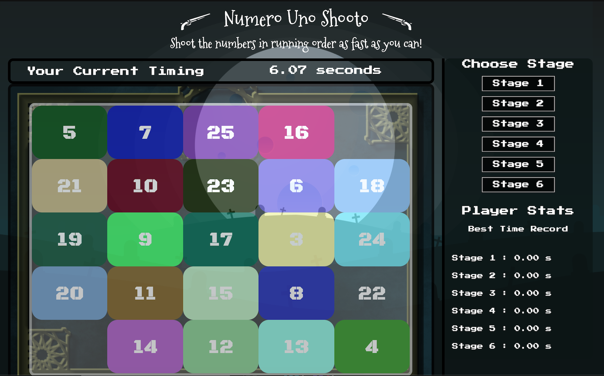

# Shoot Shoot Game
<!---
Read Me Contents
-->

### Overview

Numero Uno Shooto is a recreation of a classic arcade-style shooter game. The aim of the game is to shoot the numbers on the board in ascending order in the fastest time possible. As the stages progress, the board changes, adding new challenges for the player. 

### Screenshot of browser version
# 

### Tools used
HTML
CSS
Javascript